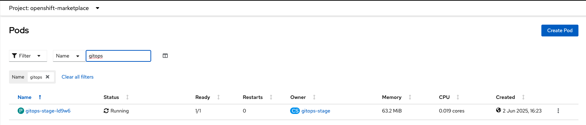
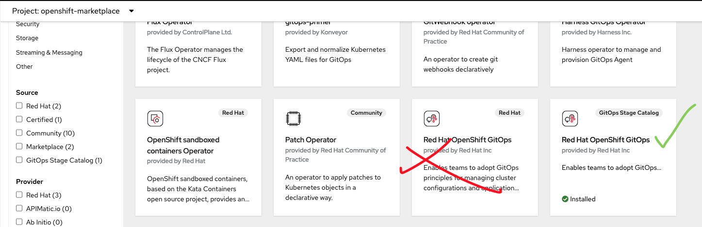

# Catalog Installation

> **Note:** This is a work in progress. Documentation will be enhanced further.

## Development/Stage Catalog Installation

Follow these steps to install the GitOps Operator using a development/stage catalog.

### 1. Create an `ImageContentSourcePolicy`

This policy ensures that OpenShift can pull images from development/stage repository.

```yaml
apiVersion: operator.openshift.io/v1alpha1
kind: ImageContentSourcePolicy
metadata:
  name: gitops-testing-icsp
spec:
  repositoryDigestMirrors:
  - source: registry.redhat.io/openshift-gitops-1/gitops-rhel8
    mirrors:
      - quay.io/redhat-user-workloads/rh-openshift-gitops-tenant/gitops-rhel8
  - source: registry.redhat.io/openshift-gitops-1/console-plugin-rhel8
    mirrors:
      - quay.io/redhat-user-workloads/rh-openshift-gitops-tenant/console-plugin-rhel8
  - source: registry.redhat.io/openshift-gitops-1/dex-rhel8
    mirrors:
      - quay.io/redhat-user-workloads/rh-openshift-gitops-tenant/dex-rhel8
  - source: registry.redhat.io/openshift-gitops-1/must-gather-rhel8
    mirrors:
      - quay.io/redhat-user-workloads/rh-openshift-gitops-tenant/must-gather-rhel8
  - source: registry.redhat.io/openshift-gitops-1/argocd-rhel8
    mirrors:
      - quay.io/redhat-user-workloads/rh-openshift-gitops-tenant/argocd-rhel8
  - source: registry.redhat.io/openshift-gitops-1/argocd-rhel9
    mirrors:
      - quay.io/redhat-user-workloads/rh-openshift-gitops-tenant/argocd-rhel9
  - source: registry.redhat.io/openshift-gitops-1/argocd-agent-rhel8
    mirrors:
      - quay.io/redhat-user-workloads/rh-openshift-gitops-tenant/argocd-agent-rhel8
  - source: registry.redhat.io/openshift-gitops-1/argo-rollouts-rhel8
    mirrors:
      - quay.io/redhat-user-workloads/rh-openshift-gitops-tenant/argo-rollouts-rhel8
  - source: registry.redhat.io/openshift-gitops-1/gitops-operator-bundle
    mirrors:
      - quay.io/redhat-user-workloads/rh-openshift-gitops-tenant/gitops-operator-bundle
  - source: registry.redhat.io/openshift-gitops-1/gitops-rhel8-operator
    mirrors:
      - quay.io/redhat-user-workloads/rh-openshift-gitops-tenant/gitops-rhel8-operator
  - source: registry.redhat.io/openshift-gitops-1/argocd-extensions-rhel8
    mirrors:
      - quay.io/redhat-user-workloads/rh-openshift-gitops-tenant/argocd-extensions-rhel8
```

Apply it using:

```bash
oc apply -f icsp.yaml
```

### 2. Create a `CatalogSource`
Update the <catalog-image> with the correct development/stage catalog image.

```yaml
apiVersion: operators.coreos.com/v1alpha1
kind: CatalogSource
metadata:
  name: gitops-test-catalog
  namespace: openshift-marketplace
spec:
  sourceType: grpc
  image: <catalog-image>
  displayName: GitOps Test Catalog
  publisher: Red Hat
```

Available development/pre-release catalog images:
- OCP v4.12: `quay.io/redhat-user-workloads/rh-openshift-gitops-tenant/catalog:v4.12`
- OCP v4.13: `quay.io/redhat-user-workloads/rh-openshift-gitops-tenant/catalog:v4.13`
- OCP v4.14: `quay.io/redhat-user-workloads/rh-openshift-gitops-tenant/catalog:v4.14`
- OCP v4.15: `quay.io/redhat-user-workloads/rh-openshift-gitops-tenant/catalog:v4.15`
- OCP v4.16: `quay.io/redhat-user-workloads/rh-openshift-gitops-tenant/catalog:v4.16`
- OCP v4.17: `quay.io/redhat-user-workloads/rh-openshift-gitops-tenant/catalog:v4.17`
- OCP v4.18: `quay.io/redhat-user-workloads/rh-openshift-gitops-tenant/catalog:v4.18`
- OCP v4.19: `quay.io/redhat-user-workloads/rh-openshift-gitops-tenant/catalog:v4.19`

Apply using:
```bash
oc apply -f catalog-source.yaml
```

### 3. Verify Catalog Pod

Ensure the catalog pod is running in the openshift-marketplace namespace.



You can check with:

```bash
oc get pods -n openshift-marketplace
```

### 4. Install GitOps Operator

From the OperatorHub, select the GitOps Test Catalog as the source and install the GitOps Operator.


