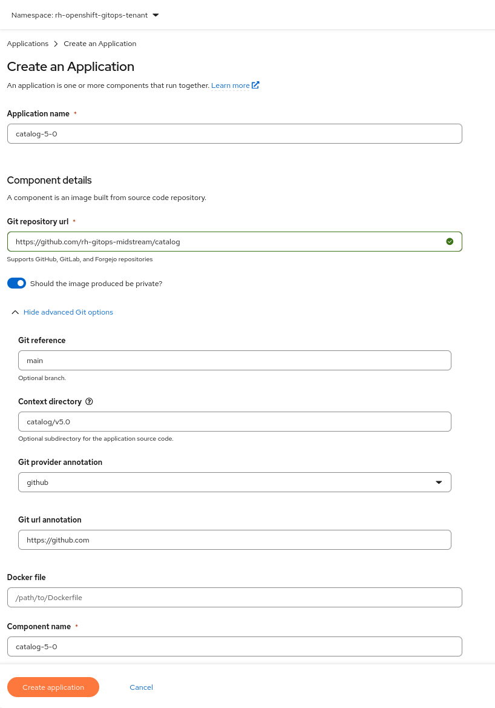

# New Catalog Onboarding Guide

This document outlines the steps to add a new catalog for specific `<new-catalog-version>` (i.e: `5.0`) to the Konflux CI system. It covers both the internal GitLab configuration and GitHub repository updates required for building the new catalog.

## Adding a New Catalog
The `<new-catalog>` name should align with "catalog-<new-catalog-version>" (replacing '.' by '-').  
Example:
For ocp 5.0, the application and the component names are `catalog-5-0`.

### Step 1: Konflux UI: Add the new catalog application and component
Access Konflux UI: https://konflux-ui.apps.stone-prd-rh01.pg1f.p1.openshiftapps.com/ns/rh-openshift-gitops-tenant/applications
Create a new application for the new catalog version:



### Step 2: Internal GitLab Configuration
#### 2.1 Create a development branch in the `konflux-release-data` GitLab repository. (**Do not fork the repository.**)
#### 2.2 Add the new catalog config

- Path:
  `tenants-config/cluster/stone-prd-rh01/tenants/rh-openshift-gitops-tenant/catalogs`

  - Add a new file with the name `<new-catalog-version>.yaml` file. Copy an existing catalog file and update the references to the `<new-catalog>`

    Example (for `<new-catalog-version>` = `5.0`):
      - copy `4.22.yaml` to `5.0.yaml` 
      - replace `catalog-4-22` by the `catalog-5-0`
      - replace `4.22` by `5.0` 
  - Update `kustomization.yaml`, adding the new file `<new-catalog-version>.yaml` to resources

```yaml
---
apiVersion: kustomize.config.k8s.io/v1beta1
kind: Kustomization
resources:
  - 4.21.yaml
  - 4.22.yaml
  - 5.0.yaml
  - <new-catalog-version>.yaml
  - catalogs.yaml
```

- Path:
  `config/stone-prd-rh01.pg1f.p1/product/ReleasePlanAdmission/rh-openshift-gitops`

  - Add the new catalog application to catalog RPAs. Update `gitops-catalog-prod.yaml` and `gitops-catalog-stage.yaml`

```yaml
---
apiVersion: appstudio.redhat.com/v1alpha1
kind: ReleasePlanAdmission
metadata:
  labels:
    release.appstudio.openshift.io/block-releases: "false"
    pp.engineering.redhat.com/business-unit: hybrid-platforms
  name: gitops-catalog-stage
  namespace: rhtap-releng-tenant
spec:
  applications:
    - catalog-4-14
    - catalog-4-15
    - catalog-4-16
    - catalog-4-17
    - catalog-4-18
    - catalog-4-19
    - catalog-4-20
    - catalog-4-21
    - catalog-4-22
    - <new-catalog>
```

#### 2.3 Build and Test

- Run the manifest generator:
```bash
./tenants-config/build-manifests.sh
```
- Run tests:
```bash
tox
```

#### 2.4 Submit Changes

- Commit your changes.
- Create a Merge Request (MR) for review. For reference see [[GITOPS] Add 4.22 catalog config](https://gitlab.cee.redhat.com/releng/konflux-release-data/-/merge_requests/16449) MR

### Step 3: GitHub Repository Updates

In https://github.com/rh-gitops-midstream/catalog repo:

#### 3.1 Add the new catalog configs
- Path:
  `catalog/`
  - Add a new folder under `catalog/` with the name `v<new-catalog-version>` (e.g., `v5.0`). Copy an existing folder from older catalog version (ex: `v4.22`) into a new one called `v<new-catalog-version>`
  - Modify the new `Dockerfile` base image to the new catalog one and keep `Readme.md` and `template.yaml` untouched. 
    Example: (for ocp 5.0 it changed to `FROM registry.redhat.io/openshift5/ose-operator-registry-rhel9:v5.0`)

#### 3.2 Add new catalog releases folder
   - Path:
  `releases/`
- Copy an existing folder from older catalog version (ex: `v4.22`) into a new one called `v<new-catalog-version>`
- Modify the new `prod-release.yaml` and `stage-release.yaml` updating the `generateName` to `<new-catalog>-*-` and the `releasePlan` to `<new-catalog>-*`

#### 3.3 Configure CI Pipelines

- Path: `.tekton/`
- Copy an older catalog version tekton files (ex: `catalog-4-22-pull-request.yaml` and `catalog-4-22-push.yaml`) and rename to match your new component:
    - `<new-catalog>-pull-request.yaml`
    - `<new-catalog>-push.yaml`
- Update the contents with the `<new-catalog>` name and relevant paths references:
  - replace `catalog-4-22` by the `<new-catalog>`
  - replace `4.22` by `<new-catalog-version>`

```yaml
piVersion: tekton.dev/v1
kind: PipelineRun
metadata:
  annotations:
    build.appstudio.openshift.io/repo: https://github.com/rh-gitops-midstream/catalog?rev={{revision}}
    build.appstudio.redhat.com/commit_sha: "{{revision}}"
    build.appstudio.redhat.com/target_branch: "{{target_branch}}"
    pipelinesascode.tekton.dev/cancel-in-progress: "false"
    pipelinesascode.tekton.dev/max-keep-runs: "3"
    pipelinesascode.tekton.dev/on-cel-expression: >-
      event == "push" && 
      target_branch == "main" && 
      (
        "catalog/v<new-catalog-version>/***".pathChanged() ||
        ".tekton/<new-catalog>-push.yaml".pathChanged() ||
        ".tekton/images-mirror-set.yaml".pathChanged() ||
        ".tekton/multi-platform-fbc-image-build.yaml".pathChanged() ||
        ".tekton/tasks/***".pathChanged()
      )
  creationTimestamp: null
  labels:
    appstudio.openshift.io/application: <new-catalog>
    appstudio.openshift.io/component: <new-catalog>
    pipelines.appstudio.openshift.io/type: build
  name: <new-catalog>-on-push
  namespace: rh-openshift-gitops-tenant
spec:
  params:
    - name: git-url
      value: "{{source_url}}"
    - name: revision
      value: "{{revision}}"
    - name: output-image
      value: quay.io/redhat-user-workloads/rh-openshift-gitops-tenant/catalog:{{revision}}
    - name: dockerfile
      value: Dockerfile
    - name: path-context
      value: catalog/v<new-catalog-version>
    - name: ocp-version
      value: "v<new-catalog-version>"
    - name: additional-tags
      value:
        - v<new-catalog-version>
    - name: catalog-template-path
      value: "catalog/v<new-catalog-version>/template.yaml"
    - name: catalog-output-path
      value: "catalog/v<new-catalog-version>/openshift-gitops-operator/catalog.json"
    - name: opm-args
      value:
        - "--migrate-level=bundle-object-to-csv-metadata"
  pipelineRef:
    name: multi-platform-fbc-image-build
  taskRunTemplate:
    serviceAccountName: build-pipeline-<new-catalog>
```

See PRs [#111](https://github.com/rh-gitops-midstream/catalog/pull/111) for reference. 

#### 3.4 Submit PR

- Commit your changes to a new branch.
- Open a Pull Request for review.
