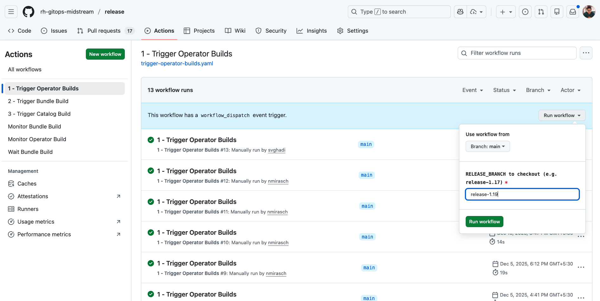

# Preparing for a Z-Stream Release

This document outlines the **pre-release activities required for a Z-stream release** to prepare the Konflux build system and related metadata.

---

## Step 1: Update OLM and Build Metadata

1. Check out the appropriate `release-<y-stream>` branch for the target Z-stream version.

2. Update the following fields in `config.yaml`:
   - `release.version`
   - `release.olm.name`
   - `release.olm.replaces`
   - `release.olm.skip-range`
   - `release.managers`

> [!IMPORTANT]
> The `latest` value in `release.olm.channel` should be removed **only if the Y-stream is no longer the latest supported stream**.  
> **Example:**  
> If `1.20` is the latest Y-stream, then `1.19` is no longer considered latest.  
> Any new `1.19.z` releases **must not** be added to the `latest` channel.

```diff
diff --git a/config.yaml b/config.yaml
index 1f6d7e9..8d125ca 100644
--- a/config.yaml
+++ b/config.yaml
@@ -1,13 +1,13 @@
 # Release Metadata
 release:
   name: OpenShift GitOps Operator
-  version: "1.19.0"
+  version: "1.19.1"
   olm:
-    name: "openshift-gitops-operator.v1.19.0"
+    name: "openshift-gitops-operator.v1.19.1"
     channel: "latest,gitops-1.19"
-    replaces: "openshift-gitops-operator.v1.18.2"
-    skip-range: ">=1.0.0 <1.19.0"
+    replaces: "openshift-gitops-operator.v1.19.0"
+    skip-range: ""
   konflux:
     repo: https://github.com/rh-gitops-midstream/release.git
     branch: release-1.19
```

3. Update the `BUILD` file with the new version.
- The suffix (e.g. `-8`) represents the build number.
- Reset it to `0` for every new Z-stream release.

```diff
diff --git a/BUILD b/BUILD
index aad225a..cc6f431 100644
--- a/BUILD
+++ b/BUILD
@@ -1 +1 @@
-v1.19.0-8
+v1.19.1-0
```

4. Commit the changes and open a pull request.

## Step 2: Update Release Plan Versions in GitLab

1. Create a development branch in the `konflux-release-data` GitLab repository.  
    **Do not fork the repository.**

2. Update version references in the ReleasePlan configuration located at:

    `tenants-config/cluster/stone-prd-rh01/tenants/rh-openshift-gitops-tenant/gitops-<y-stream>.yaml`

    > [!TIP]
    > Use **Find & Replace**.  
    > Example: replace `1.19.0` with `1.19.1`.

    ```diff
    - {{ advisory.spec.product_name }} v1.19.0 bug fix and enhancement update
    + {{ advisory.spec.product_name }} v1.19.1 bug fix and enhancement update
    ```

3. Build and test the configuration:

    ```bash
    # Generate manifests
    ./tenants-config/build-single.sh rh-openshift-gitops-tenant

    # Run tests
    tox
    ```

4. Commit the changes and create a merge request targeting the main branch.


## Step 3: Create Release YAMLs

Before creating staging or production release YAMLs, ensure that all relevant JIRA issues are properly tagged with the correct **Fix Version**.  
Konflux release automation relies on the Fix Version field to automatically populate errata.

### Create Release Files

1. Copy the staging and production release YAMLs from the previous release located in the `releases/` directory.

2. Update the following fields:
   - `metadata.generateName`
   - `spec.releasePlan`  
     (Only required if the release YAMLs are copied from a different Y-stream.)

3. The `spec.snapshot` value should be populated during the actual release.

### Release Notes Type

- Set `releaseNotes.type` to `RHBA` by default.
- Use `RHSA` only if the release includes CVE fixes.
- For `RHSA` releases, explicitly list all CVEs and affected components under  
  `spec.data.releaseNotes.cves`.

#### Example RHSA Release YAML

```yaml
apiVersion: appstudio.redhat.com/v1alpha1
kind: Release
metadata:
  generateName: gitops-1.19.1-prod-
  namespace: rh-openshift-gitops-tenant
spec:
  gracePeriodDays: 7
  releasePlan: gitops-1-19-prod
  snapshot: <populate during release>
  data:
    releaseNotes:
      type: RHSA
      cves:
        - key: CVE-2025-49844
          component: gitops-operator-1-19
        - key: CVE-2024-45337
          component: argocd-1-19
        - key: CVE-2024-45337
          component: argocd-rhel9-1-19
```

> [!IMPORTANT]
> Always create and validate a staging release first once builds are ready.   
> Ensure the `releasePlan` value is correct for staging versus production.

## Step 4: Update Sources

Before triggering the RC build, update source references in `config.yaml` as required for the release. 

## Step 5: Generate the Build

- Trigger the `1 - Trigger Operator Builds` GitHub Actions workflow.
- This workflow is located in the `Actions` tab of the release GitHub repository.
- Provide the appropriate `release-<y-stream>` branch name as input.



## Step 6: Update Release YAMLs and Create the Staging Release

Once the build workflow completes, a new PR is created in the
[catalog repository](https://github.com/rh-gitops-midstream/catalog).
Use that PR to validate the catalog content and produce a Release Candidate (RC).

1. Wait for the catalog PR checks to pass.
2. Share the temporary build for each component using the snapshot container image
   references provided in the PR.
3. After the catalog PR is merged and all checks pass, install the updated catalog
   into the testing environment by following the
   [catalog installation](catalog.installation.md) guide.
4. The RC can now be shared with QE for testing.

### Preserve the Snapshot for Release Time

To ensure the snapshot is available when the release is created, back it up and
re-apply it in the cluster with a stable name.

1. Back up the snapshot:

   ```bash
   oc get snapshot gitops-1-19-mqncq -o yaml > snapshot-backup.yaml
   ```

   If the snapshot has been garbage-collected, retrieve it via
   [kubeArchive](https://kubearchive.github.io/kubearchive/main/cli/installation.html):

   ```bash
   kubectl ka get snapshot gitops-1-19-mqncq -o yaml > snapshot-backup.yaml
   ```

2. Edit `snapshot-backup.yaml`:
   - Remove `ownerReferences`.
   - Rename the snapshot to `gitops-<release-version>-build-b`.

3. Re-apply the snapshot:

   ```bash
   oc apply -f snapshot-backup.yaml
   ```

### Create the Staging Release Object

1. Update the staging release YAML:
   - Set `spec.snapshot` to `gitops-<release-version>-build-b`.
   - Ensure `spec.releasePlan` targets the **staging** plan.
2. Create the staging release object in Konflux:

   ```bash
   oc create -f stage-release.yaml
   ```

3. Wait for the staging release to complete successfully in Konflux.

> TODO: Add detailed documentation for the build pipeline stages and expected outputs.
