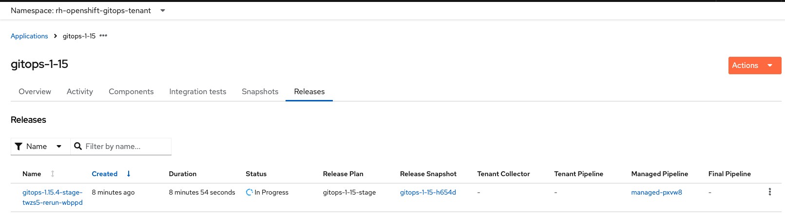
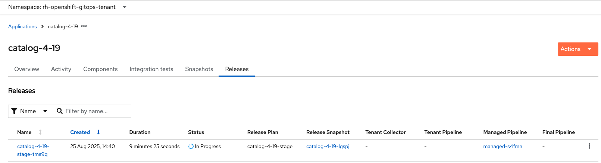

# How to Release OpenShift GitOps with Konflux?

> **Note:** This is a work in progress. Documentation will be enhanced further.

Releasing final artifacts for OpenShift GitOps with Konflux is a two-step process: 
1. Release the component images
2. Release the catalog images for supported OCP versions


### Step 1: Release Component Images

Component images are released by applying a **Release CR** on the Konflux cluster.
The Release CRs are located in the repository under `releases/<version>/`.  
Each Release CR contains:
- Snapshot details (component images to be released)
- Errata information

##### Pre-Release Checklist

Before starting the release, ensure that:
- You have checked out the desired `release-*` branch of this repository.
- You are logged into the Konflux cluster with sufficient permissions.

##### Apply the Production Release CR

To trigger a production release, apply the corresponding CR:

```bash
oc create -f releases/v1.15.4/prod-release.yaml
```

> [!TIP]
> You can also use `stage-release.yaml` for a **staging release**.
This is recommended to validate artifacts before pushing them into production, reducing the risk of failure during the final release.

##### Monitor the Release

You can monitor the newly created release object via the **Konflux UI**:
- Navigate to: **Applications → gitops-x.y → Releases**
- Namespace: `rh-openshift-gitops-tenant`
- Locate your release under the **Releases** section

To track execution details:
- Use the **ManagePipeline** column
- Click the provided links to access the **managed pipeline run**



##### Errata Details Post Release

Once the Release has successfully completed, the errata will be automatically generated using the data provided in the Release object.

You can find the generated errata link by:
- Navigating to the **Konflux UI → Applications → gitops-x.y → Releases**
- Selecting your completed release
- Checking the Errata field in Results section in **managed pipeline run**

TODO: <IMAGE>

### Step 2: Release Catalog Images

Once the component images are available on registry.redhat.io, proceed with the catalog release.

The Release CRs for catalogs are maintained in the [catalog repository](https://github.com/rh-gitops-midstream/catalog) under `releases/<ocp-version>/` directory.

##### Pre-Release Checklist

Before starting the catalog release, ensure that:
- You have cloned the [catalog repository](https://github.com/rh-gitops-midstream/catalog) and checked out the main branch.
- You are logged into the Konflux cluster with sufficient permissions.

> [!IMPORTANT] 
> For the catalog repo, main is the only branch. Ensure you are on main when applying release objects.

##### Apply the Production Release CR

```bash
oc create -f releases/v4.19/prod-release.yaml
```

> [!CAUTION]
> If you are performing simultaneous releases for multiple versions, ensure that all component versions referenced in the catalog have been successfully released before triggering the catalog release.
Otherwise, the catalog pipeline may fail due to missing or unpublished images.

> [!TIP]
> You can also use `stage-release.yaml` for a **staging release**.
This is recommended to validate artifacts before pushing them into production, reducing the risk of failure during the final release.

##### Monitor the release

You can monitor the newly created release object via the **Konflux UI**:
- Navigate to: **Applications → catalog-x.y → Releases**
- Namespace: `rh-openshift-gitops-tenant`
- Locate your release under the **Releases** section

To track execution details:
- Use the **ManagePipeline** column
- Click the provided links to access the **managed pipeline run**



### Post Release Validation

TODO

### TroubleShooting

TODO

